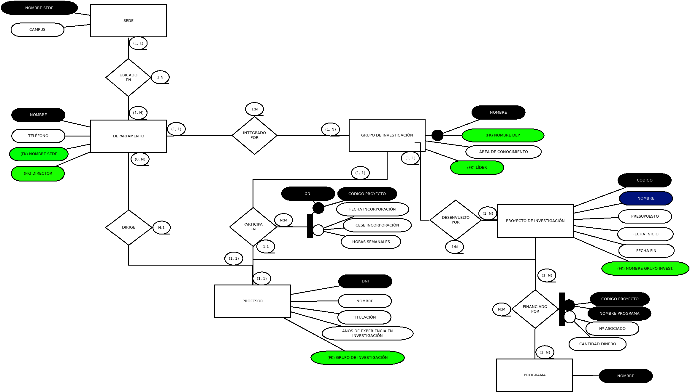
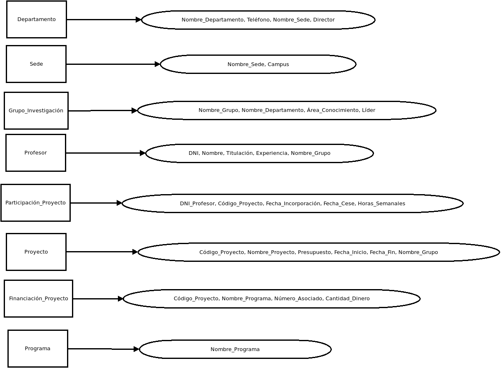
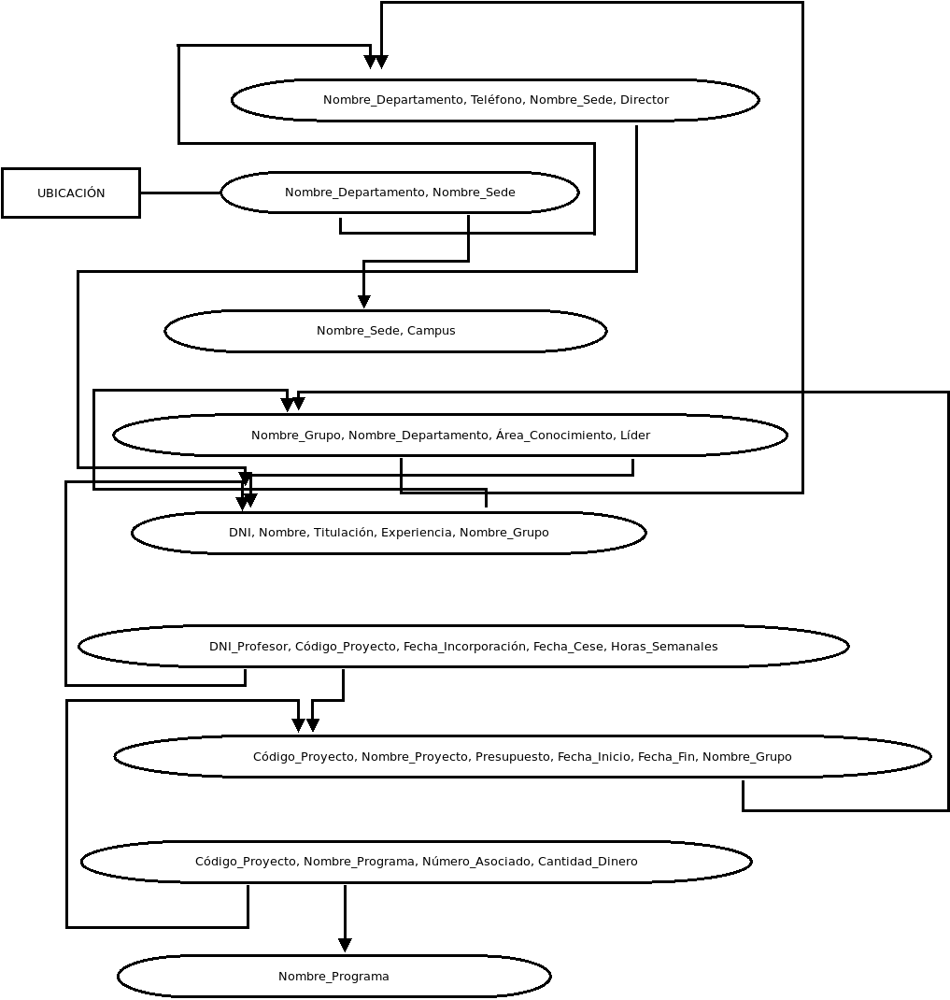

# Exercicio DDL 1 - Proxectos de investigación

Na Universidade de A Coruña deséxase levar un control sobre os proxectos de investigación que se desenvolven. Para iso decídese empregar unha base de datos que conteña toda a información sobre os proxectos, departamentos, grupos de investigación e profesores.

Un departamento identifícase polo seu nome (Informática, Enxeñería, etc). Ten unha sede situada nun determinado campus, un teléfono de contacto e un director, tamén profesor da Universidade de A Coruña.

Dentro dun departamento créanse grupos de investigación. Cada grupo ten un nome único dentro do departamento (pero que pode ser o mesmo en distintos departamentos) e está asociado a unha área de coñecemento (bases de datos, intelixencia artificial, sistemas e comunicacións, etc). Cada grupo ten un líder, tamén profesor da Universidade de A Coruña.

Un profesor está identificado polo seu DNI. Del deséxase saber o nome, tilulación, anos de experiencia en investigación, grupo de investigación no que desenvolve o seu labor e proxectos nos que traballa.

Cada proxecto de investigación ten un nome, un código único, un orzamento, datas de inicio e terminación e un grupo que o desenvolve. Doutra banda, pode estar financiado por varios programas. Dentro de cada programa cada proxecto ten un número asociado e unha cantidade de diñeiro financiada (por exemplo, o proxecto BDE - Bases de Datos Espaciais ten o número 1337 dentro do programa A Solaris e volta que lle financia con 10.000 euros).

Un profesor pode participar en varios proxectos. En cada proxecto incorpórase nunha determinada data e cesa noutra, tendo unha determinada dedicación (en horas á semana) durante ese período.

## Esquema Entidad-Relación

## Normalización

### 1º Forma normal: Una relación está en 1FN si cada atributo toma un solo valor del dominio al que pertenece.

**- [x] La relación está en primera forma normal al no haber atributos repetidos o con una misma semántica en la BBDD.**

### 2º Forma normal: Una relación está en 2FN si está en 1FN y si todos los atributos no clave dependen por completo de la clave principal.

**- Una sede no depende de uno de sus departamentos para saber su ubicación, más bien sería al revés. La relación no cumple con la segunda forma normal, por lo que procedemos a crear otra relación que represente la ubicación de un departamento: queremos saber dónde se ubica un departamento (primero debemos saber el nombre del departamento que queremos) y en qué sede en concreto, por lo que creamos una relación llamada Ubicación, que contendrá el nombre del departamento y el nombre de la sede.**
**- [x] Todos los atributos dependen funcionalmente de la clave principal al completo. Se cumple la 2FN.**

