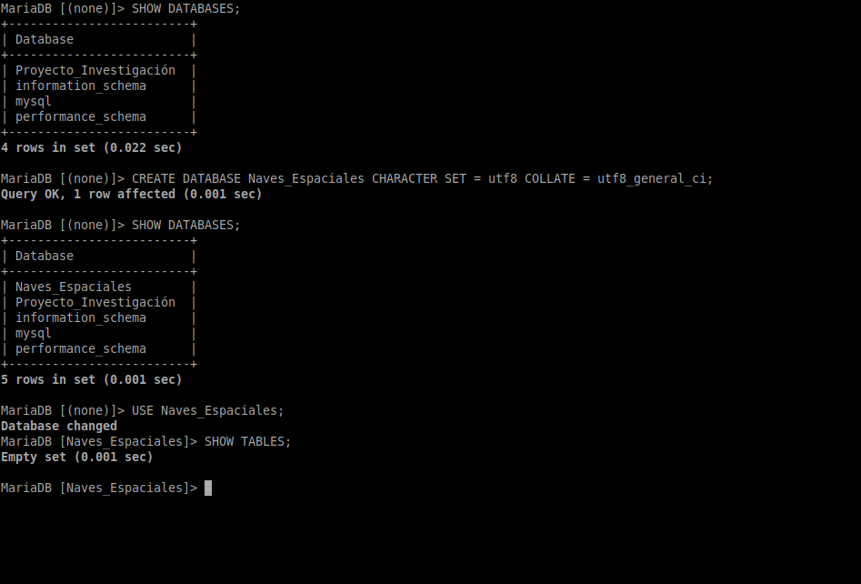
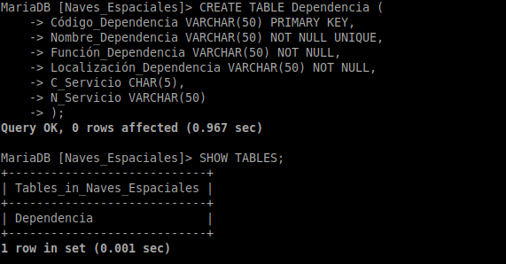
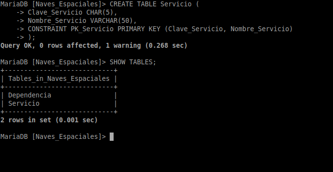
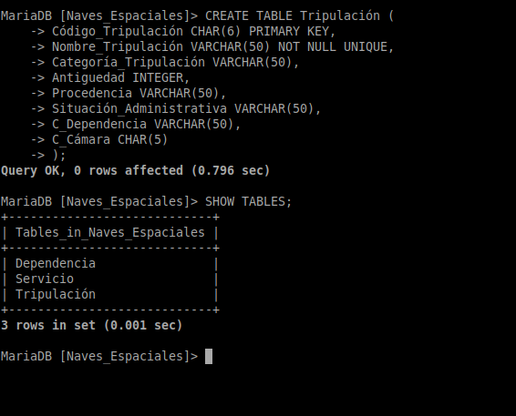
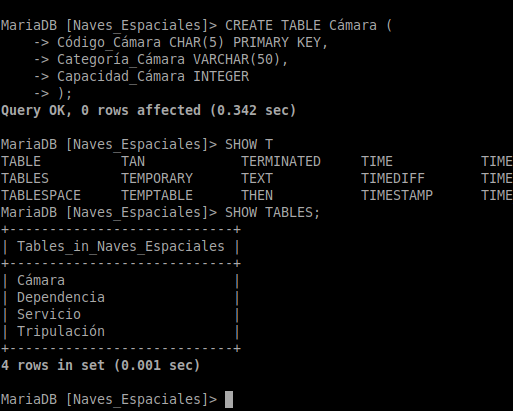

# Exercicio DDL 2 Naves espaciais

O Ministerio da Exploración Interplanetaria da Federación Unida de Planetas desexa desenvolver un Sistema de Información para a nave espacial Stanisław Lem 72 que proximamente se lanzará ao espazo.

A nave espacial componse de distintas dependencias, e cada unha delas ten un nome, un código (único para cada dependencia), unha función e unha localización. Cada dependencia está baixo o control dun determinado servizo, identificado por un nome e unha clave. Todo servizo da nave (Servizo de Operacións, Comando e Control, Seguridade, etc.) ha de estar asignado polo menos a unha dependencia.

Quérese levar ao día unha relación da tripulación da nave. Esta información contén o nome, código, categoría, antigüidade, procedencia e situación administrativa (en servizo, de baixa, etc). Cada tripulante está asignado a unha dependencia que desexa coñecer, así como a cámara na que se aloxa. Unha cámara é unha dependencia que posúe dúas características propias, a súa categoría e a súa capacidade.

Doutra banda, deséxanse coñecer os planetas que visitou cada membro da tripulación e o tempo que permaneceron neles para saber as persoas con quen se pode contar á hora de realizar unha exploración interplanetaria.

De cada planeta coñécese o seu nome e código, a galaxia e coordenadas nas que se atopa. Algúns planetas atópanse poboados por diversas razas, cada unha nunha certa cantidade de individuos. De cada raza almacénase información sobre o nome, poboación total e dimensións medias (altura, anchura, peso).

## Esquema del ejercicio normalizado


## Implementación en MariaDB

**Lo primero que haremos será crear la estructura de la base de datos. La llamaremos 'Naves_Espaciales':**

```SQL
CREATE DATABASE Naves_Espaciales CHARACTER SET = utf8 COLLATE = utf8_general_ci;
```



**Después de crear la estructura, procedemos a crear las tablas.**

### Creación de tablas

#### Tabla Dependencia:

```SQL
CREATE TABLE Dependencia (
    Código_Dependencia       VARCHAR(50) PRIMARY KEY,
    Nombre_Dependencia       VARCHAR(50) NOT NULL UNIQUE,
    Función_Dependencia      VARCHAR(50) NOT NULL,
    Localización_Dependencia VARCHAR(50) NOT NULL,
    C_Servicio               CHAR(5),
    N_Servicio               VARCHAR(50)
);
```


#### Tabla Servicio:

```SQL
CREATE TABLE Servicio (
    Clave_Servicio  CHAR(5),
    Nombre_Servicio VARCHAR(50),
    CONSTRAINT PK_Servicio PRIMARY KEY (Clave_Servicio, Nombre_Servicio)
);
```



#### Tabla Tripulación:

```SQL
CREATE TABLE Tripulación (
    Código_Tripulación       CHAR(6) PRIMARY KEY,
    Nombre_Tripulación       VARCHAR(50) NOT NULL UNIQUE,
    Categoría_Tripulación    VARCHAR(50),
    Antiguedad               INTEGER,
    Procedencia              VARCHAR(50),
    Situación_Administrativa VARCHAR(50),
    C_Dependencia            VARCHAR(50),
    C_Cámara                 CHAR(5)
);
```



#### Tabla Cámara:

```SQL
CREATE TABLE Cámara (
    Código_Cámara CHAR(5) PRIMARY KEY,
    Categoría_Cámara VARCHAR(50),
    Capacidad_Cámara INTEGER
);
```



**Continuará...**